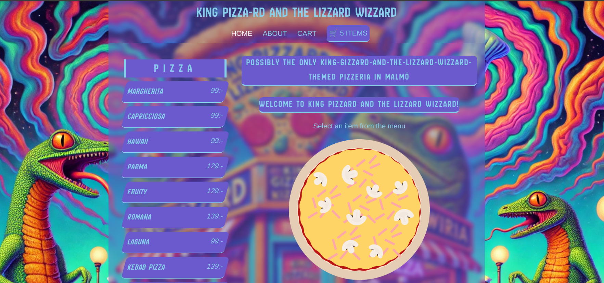
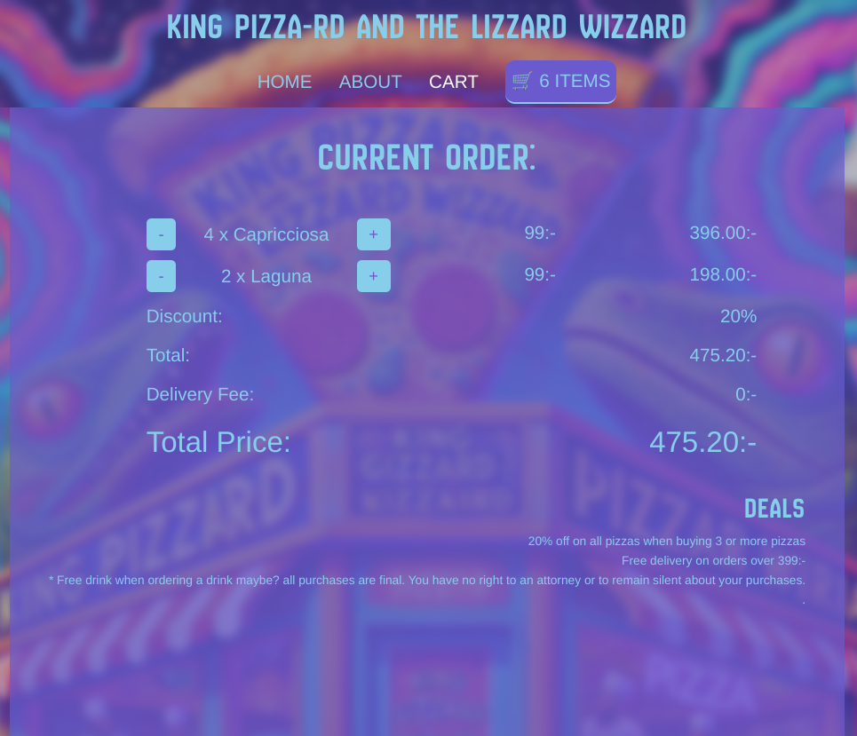

# King Pizzard and the Lizzard Wizzard - Pizzeria Website

Welcome to King Pizzard and the Lizzard Wizzard, a magical pizzeria website where pizza meets wizardry! The site is a whimsical and interactive experience that tells the story of Pizzard, the pizza-loving wizard who brings enchantment to every slice. Whether you’re here to learn about the legendary pizzas or just marvel at the magic, this README will walk you through the website’s functionality, the technologies used, and the structure behind it.

This website is a front-end project built with Vue 3 and powered by Vite. The goal of the project is to provide an engaging user experience while serving as an online hub for the pizzeria, combining both functional shopping cart features and dynamic menu loading from an external API.

The website is designed with a fun and magical narrative that immerses users in the world of King Pizzard. The story of Pizzard, the wizard pizza maker, is shared on the "About Us" page, where users can learn about the magic behind the pizzas. Additionally, the website integrates an interactive shopping cart and menu, offering users the ability to browse available pizza items and manage their cart.

## Homepage/Pizza Menu

## Checkout Page

## Technologies Used

- Vue 3: The website is built using Vue.js, a progressive JavaScript framework. The app utilizes Vue's Composition API to manage state and lifecycle events.
- Vite: Vite is used as the build tool and development server for the project. Vite is fast, efficient, and provides hot-module replacement for smoother development experiences.
- Axios: Axios is used to fetch data from an external API to load the menu items dynamically.
- Vue Router: This is used to manage navigation between different pages on the website.
- Local Storage: The shopping cart is saved in the browser's local storage to persist cart items even if the page is refreshed.

### Features

1. Dynamic Menu Fetching:
   The menu is loaded dynamically from an external API. The API endpoint used is https://6ldruff9ul.execute-api.eu-north-1.amazonaws.com/menu, where the pizza items are fetched using Axios.
   The menu items are stored in a reactive state using Vue's ref() to make the interface responsive to changes.
2. Interactive Cart:
   The shopping cart is managed by Vue's reactive state system and persists in localStorage.
   Users can add and remove items from the cart. Changes to the cart trigger a state update that reflects on the page, and the cart contents are saved in localStorage. Calulations are made to determine the total price of the items in the cart, adding up the prices of each item, incrementing and decrementing items and adding discounts/dilivery charges.
   The cart's length is dynamically updated and tracked to ensure an accurate display of the number of items in the cart.
   The cart also tracks whether items have been added or removed using a cartChange state to detect "increment" or "decrement" actions.
3. About Us Page:
   The "About Us" section tells the whimsical story of Pizzard, the pizza wizard, and his magical pizzeria. The story is enhanced with styling, creating a fun and immersive reading experience for users.
# PizzaSite
